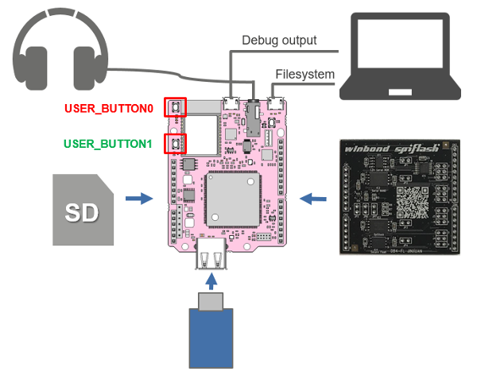

# GR-LYCHEE_Switching_BlockDevice
GR-LYCHEEで動作するサンプルプログラムです。  

## 概要
様々な BlockDevice を PC上から Filesystem 経由で読み書きできるサンプルプログラムです。  

## 構成
* [GR-LYCHEE](https://os.mbed.com/platforms/Renesas-GR-LYCHEE/) (必須)
* [Winbond Flash Memory Sample Shield](http://www.winbond.com/hq/about-winbond/news-and-events/events/product-promotion/promotion00020.html) (任意)
* SDカード (任意)
* USBメモリ (任意)
* オーディオスピーカー (任意)

  

``Winbond Flash Memory Sample Shield`` 上のデバイス ``W25M161AVEIT`` と ``W74M12FVZPIQ`` の Serial NOR が使用できます。デバイスの切り替えは Shield 上の Jumper で行います。Jumper設定については User Guide を参照ください。  
Winbond Flash Memory Sample Shield を使用しない場合は `main.cpp` の下記マクロに`0`を設定してください。
```cpp
#define USE_SAMPLE_SHIELD      (1)  // [Winbond Flash Memory Sample Shield]  0:not use,  1:use
```

## 使い方
GR-LYCHEEとPCをUSBケーブルで接続することで、デバイス内をマスストレージ機器として参照することができます。(初回接続時はフォーマットが必要です。)  
オーディオスピーカーを接続している場合、PCからWAVファイル(.wav)をストレージに書き込むと、その曲を再生します。`USER_BUTTON0`を押すと次の曲を再生します。  

`USER_BUTTON1`を押すとBlockDeviceが下記の順番で切り替わります。  

| BlockDevice | Description |
|:------------|:------------|
| SPIF        | Winbond Flash Memory Sample Shield 上のSerial NORをストレージとして使用。 |
| FlashIAP    | GR-LYCHEE上のSerial Flash。先頭1MBをプログラムとして使用し、残り7MBをストレージとして使用。|
| Heap        | ヒープメモリのうち1MBをストレージとして使用。 |
| SD          | SDをストレージとして使用。 |
| USB         | USBメモリをストレージとして使用。 |
